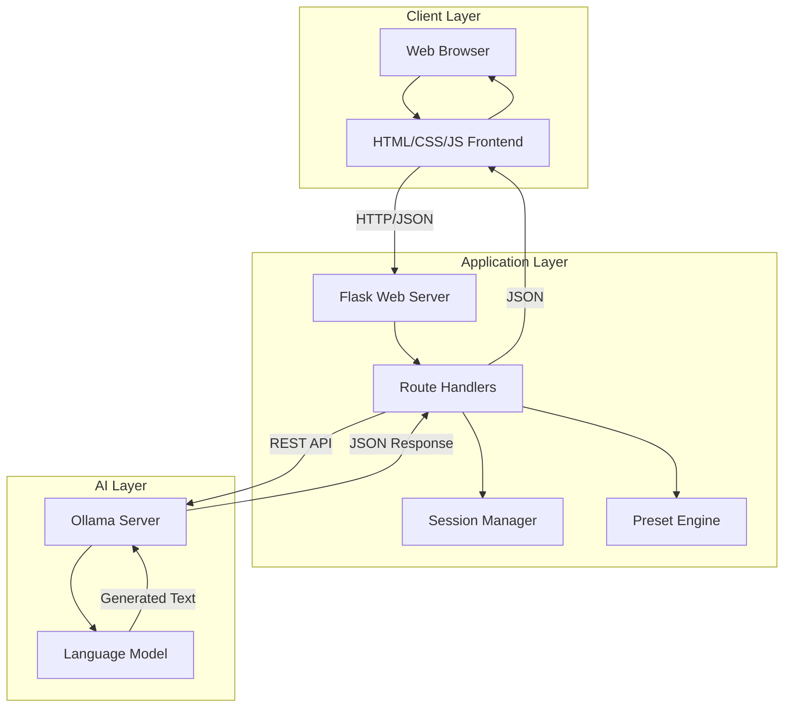

# Architecture Documentation

## Table of Contents
- [High-Level Architecture](#high-level-architecture)
- [Project Structure](#project-structure)
- [Component Overview](#component-overview)
- [Request/Response Flow](#requestresponse-flow)
- [Data Models](#data-models)
- [Key Design Decisions](#key-design-decisions)
- [Extension Points](#extension-points)
- [Security Considerations](#security-characteristics)
- [Performance Characteristics](#performance-characteristics)

---

## High-Level Architecture

The ComfyUI Prompt Generator follows a **three-tier architecture** with local AI processing:



### Architecture Principles

1. **Separation of Concerns**: Frontend, backend, and AI processing are decoupled
2. **Local-First**: All processing happens on the user's machine
3. **Stateless API**: Routes are stateless except for chat sessions
4. **Modular Design**: Components can be modified independently
5. **Privacy-Focused**: No external API calls or data collection

---

## Project Structure

### File Organization

```
comfyui-prompt-generator/
│
├── 📁 .github/
│   └── 📁 workflows/
│       └── 📄 ci.yml                      # GitHub Actions CI/CD pipeline
│
├── 📁 templates/
│   └── 📄 index.html                      # Frontend SPA (~500+ lines)
│
├── 📁 tests/
│   ├── 📄 __init__.py
│   ├── 📄 conftest.py                     # Pytest fixtures
│   ├── 📄 test_app.py                     # Route and functionality tests
│   └── 📄 test_presets.py                 # Preset validation tests
│
├── 📁 logs/
│   └── 📄 app.log                         # Application logs (auto-created)
│
├── 📄 prompt_generator.py                 # Flask backend (~1,760 lines)
├── 📄 prompt_history.db                   # SQLite database (auto-created)
├── 📄 requirements.txt                    # Production dependencies
├── 📄 requirements-dev.txt                # Development dependencies
├── 📄 .env.example                        # Environment config template
├── 📄 .env                                # Your local config (gitignored)
├── 📄 .flake8                             # Linting configuration
├── 📄 .gitignore                          # Git ignore patterns
├── 📄 Makefile                            # Development commands
├── 📄 setup.sh                            # Unix setup script
├── 📄 setup.bat                           # Windows setup script
├── 📄 README.md                           # Main documentation
├── 📄 ARCHITECTURE.md                     # This file
├── 📄 CONTRIBUTING.md                     # Contributor guide
├── 📄 CLAUDE.md                           # AI development guide
├── 📄 EXAMPLES.md                         # Usage examples
├── 📄 CHANGELOG.md                        # Version history
└── 📄 LICENSE                             # MIT License
```

### Component Breakdown

**Application Code**: ~2,260 lines
- `prompt_generator.py`: ~1,760 lines (Backend)
- `templates/index.html`: ~500 lines (Frontend)

**Documentation**: ~5,000+ lines
- README.md, ARCHITECTURE.md, EXAMPLES.md, CONTRIBUTING.md, CLAUDE.md, CHANGELOG.md

**Tests**: Comprehensive pytest suite
- Route testing, preset validation, error handling

**Configuration**:
- `.env` for environment variables
- `.flake8` for code quality
- `Makefile` for dev workflow

### Preset Breakdown

The application supports **two preset systems** (toggled via `ENABLE_HIERARCHICAL_PRESETS` flag):

#### **Legacy Preset System** (80+ curated presets)

1. **Styles (19 presets)**
   - Cinematic, Anime, Photorealistic, Oil Painting, Digital Art
   - Watercolor, Cyberpunk, Fantasy Art, Comic Book, Minimalist
   - Surreal, Vintage, 3D Render, Pencil Sketch
   - **NSFW**: Boudoir, Pin-up, Artistic Nude, Glamour, Sensual Portrait

2. **Artists/Photographers (24 presets)**
   - Digital Artists: Greg Rutkowski, Artgerm, Ross Tran, Loish
   - Traditional: Alphonse Mucha, H.R. Giger, Moebius, Zdzisław Beksiński
   - Photographers: Ansel Adams, Annie Leibovitz, Steve McCurry, Peter Lindbergh, Sebastião Salgado, Irving Penn
   - Animation: Hayao Miyazaki, Makoto Shinkai, Simon Stålenhag
   - **NSFW**: Helmut Newton, Ellen von Unwerth, Rankin, David LaChapelle, Patrick Demarchelier, Luis Royo

3. **Composition (21 presets)**
   - Portrait, Landscape, Close-up, Wide Shot, Medium Shot
   - Extreme Close-up, Bird's Eye View, Low Angle, High Angle
   - Dutch Angle, Rule of Thirds, Symmetrical, Leading Lines
   - Frame within Frame, Golden Ratio
   - **NSFW**: Reclining Pose, Over Shoulder, Back View, Figure Study, Intimate Close

4. **Lighting (20 presets)**
   - Natural: Golden Hour, Blue Hour, Natural Window Light, Harsh Sunlight, Overcast
   - Studio: Professional Studio Lighting, Soft Diffused
   - Creative: Neon, Volumetric, Backlit, Dramatic Shadows
   - Atmospheric: Moonlight, Candlelight, Fire Light, Underwater Light
   - **NSFW**: Silk Lighting, Low Key Dramatic, Boudoir Soft, Rim Light Silhouette, Warm Amber Glow

#### **Hierarchical Preset System** (70+ professional artists across 7 categories)

**Level 1 - Main Categories (7):**
- 📸 Photography
- 🎨 Comic Book Art
- 🎌 Anime/Manga
- 🐉 Fantasy Art
- 😱 Horror
- 🤖 Sci-Fi Art
- 🔞 Adult/NSFW Photography

**Level 2 - Types** (varies by category, 3-8 per category):
- Photography: Portrait, Landscape, Street, Fashion, Wildlife, Macro
- Comic Book Art: Marvel Style, DC Style, Manga, Indie Comics
- Anime/Manga: Shonen, Shojo, Studio Ghibli, Seinen
- Fantasy Art: High Fantasy, Dark Fantasy, Fairy Tale
- Horror: Gothic, Body Horror, Cosmic Horror, Folk Horror
- Sci-Fi: Cyberpunk, Space Opera, Hard Sci-Fi, Retro-Futurism
- **Adult/NSFW**: Boudoir, Artistic Nude, Glamour, Pin-up, Sensual Portrait

**Level 3 - Artists** (70+ total, 3-20 per type):
- Photography/Portrait: Annie Leibovitz, Irving Penn, Richard Avedon, etc.
- Comic Book/Marvel: Jim Lee, Jack Kirby, John Romita Sr., etc.
- Fantasy: Greg Rutkowski, Frank Frazetta, Boris Vallejo, etc.
- Horror: H.R. Giger, Bernie Wrightson, Zdzisław Beksiński, etc.
- **Adult/NSFW**: Helmut Newton, Ellen von Unwerth, Rankin, etc.
- And many more...

**Additional Features:**
- **Preset Packs**: 9 quick-start professional combinations
  - 90s X-Men Comic (Jim Lee)
  - Studio Ghibli Magic
  - Blade Runner Street Scene (Syd Mead)
  - Epic Fantasy Battle (Greg Rutkowski)
  - Leibovitz Portrait Session
  - **Newton Bold Fashion** (NSFW - Helmut Newton style)
  - **Vintage Pin-up Classic** (NSFW - 1950s retro)
  - **Artistic Figure Study** (NSFW - Classical nude)
  - **Playful Boudoir** (NSFW - Ellen von Unwerth style)

- **Universal Options**: Cross-cutting atmospheric enhancements
  - Mood (multi-select): Dramatic, Peaceful, Mysterious, Epic, etc.
  - Time of Day: Golden Hour, Dawn, Dusk, Night, etc.
  - Lighting: Volumetric, Neon, Natural Light, etc.
  - Weather/Atmosphere: Rainy, Foggy, Clear, Stormy, etc.
  - Color Palette: Warm Tones, Cool Tones, Monochrome, etc.
  - Camera Effects (multi-select): Bokeh, Motion Blur, etc.

### Disk Usage

**Minimal footprint:**
- Application code: ~100 KB
- Documentation: ~200 KB
- Dependencies (in venv): ~50 MB
- Database (varies): 1-10 MB depending on usage
- Logs (with rotation): Max 50 MB (10MB × 5 backups)

**Total**: ~50-60 MB including virtual environment

### Key File Purposes

| File | Lines | Purpose | Priority |
|------|-------|---------|----------|
| `prompt_generator.py` | ~1,760 | Core application logic | 🔴 Critical |
| `templates/index.html` | ~500 | User interface | 🔴 Critical |
| `requirements.txt` | 4 | Production dependencies | 🔴 Critical |
| `prompt_history.db` | N/A | Prompt history storage | 🟡 Important |
| `README.md` | 900+ | Main documentation | 🟡 Important |
| `ARCHITECTURE.md` | 1,200+ | Technical docs (this file) | 🟢 Reference |
| `.env` | 10 | Local configuration | 🟡 Important |
| `tests/` | Multiple | Quality assurance | 🟢 Development |
| `Makefile` | 150+ | Development workflow | 🟢 Development |

---

## Component Overview

### 1. Frontend (Single-Page Application)

**Location**: `templates/index.html`

**Technology Stack**:
- Vanilla JavaScript (ES6+)
- HTML5 with semantic markup
- CSS3 with custom properties (gradients, animations)

**Responsibilities**:
- Render user interface
- Handle user interactions
- Manage UI state (mode switching, preset selection)
- Communicate with backend via fetch API
- Display generated prompts with copy functionality
- Maintain chat history display

**Key Components**:

```
Frontend Architecture:
┌─────────────────────────────────────────────┐
│           User Interface Layer              │
│  ┌──────────┐  ┌──────────┐  ┌──────────┐  │
│  │  Input   │  │ Presets  │  │  Output  │  │
│  │  Form    │  │ Dropdowns│  │  Display │  │
│  └──────────┘  └──────────┘  └──────────┘  │
├─────────────────────────────────────────────┤
│         JavaScript Event Handlers           │
│  ┌──────────┐  ┌──────────┐  ┌──────────┐  │
│  │ Generate │  │   Chat   │  │  Reset   │  │
│  │  Click   │  │  Submit  │  │  Click   │  │
│  └──────────┘  └──────────┘  └──────────┘  │
├─────────────────────────────────────────────┤
│            API Communication                │
│         fetch() → Backend Routes            │
└─────────────────────────────────────────────┘
```

**State Management**:
- Local UI state (no Redux/Vuex needed)
- Chat history stored in DOM
- Current mode tracked via radio buttons
- Preset selections read from dropdown values

---

### 2. Backend (Flask Application)

**Location**: `prompt_generator.py`

**Technology Stack**:
- Flask 3.0.0 (lightweight WSGI framework)
- Python 3.10+
- Server-side sessions with signed cookies
- python-dotenv for configuration

**Core Routes**:

| Route | Method | Purpose | Authentication |
|-------|--------|---------|----------------|
| `/` | GET | Serve main HTML page | None |
| `/presets` | GET | Return preset configurations | None |
| `/models` | GET | Return list of installed Ollama models | None |
| `/generate` | POST | One-shot prompt generation | None |
| `/generate-stream` | POST | One-shot generation with SSE streaming | None |
| `/chat` | POST | Conversational refinement | Session-based |
| `/chat-stream` | POST | Conversational mode with SSE streaming | Session-based |
| `/reset` | POST | Clear chat history | Session-based |
| `/history` | GET | Retrieve prompt history (with search) | None |
| `/history/<id>` | DELETE | Delete specific history item | None |

**Hierarchical Preset Routes** (when `ENABLE_HIERARCHICAL_PRESETS=true`):

| Route | Method | Purpose | Authentication |
|-------|--------|---------|----------------|
| `/api/categories` | GET | Get all main categories (6 categories) | None |
| `/api/categories/<id>/types` | GET | Get types for a category (Level 2) | None |
| `/api/categories/<cat_id>/types/<type_id>/artists` | GET | Get artists for a type (Level 3) | None |
| `/api/artists/<cat_id>/<type_id>/<artist_id>/technical` | GET | Get technical options (Level 4 - Future) | None |
| `/api/artists/<cat_id>/<type_id>/<artist_id>/specifics` | GET | Get scene specifics (Level 5 - Future) | None |
| `/api/preset-packs` | GET | Get quick-start preset combinations | None |
| `/api/universal-options` | GET | Get universal options (mood, lighting, etc.) | None |

**Architecture Pattern**: RESTful API with Flask blueprints pattern (future enhancement)

```
Backend Architecture:
┌─────────────────────────────────────────────┐
│              Flask Application              │
│                                             │
│  ┌─────────────────────────────────────┐   │
│  │         Route Handlers              │   │
│  │  ┌──────┐ ┌──────┐ ┌──────┐        │   │
│  │  │  /   │ │/gene │ │/chat │        │   │
│  │  │      │ │-rate │ │      │        │   │
│  │  └──────┘ └──────┘ └──────┘        │   │
│  └─────────────────────────────────────┘   │
│                    ↓                        │
│  ┌─────────────────────────────────────┐   │
│  │      Business Logic Layer           │   │
│  │  ┌──────────┐  ┌──────────────┐    │   │
│  │  │ Preset   │  │  Message     │    │   │
│  │  │ Builder  │  │  Formatter   │    │   │
│  │  └──────────┘  └──────────────┘    │   │
│  └─────────────────────────────────────┘   │
│                    ↓                        │
│  ┌─────────────────────────────────────┐   │
│  │     Integration Layer               │   │
│  │  ┌──────────────────────────────┐   │   │
│  │  │   call_ollama() Function     │   │   │
│  │  │   - HTTP client              │   │   │
│  │  │   - Error handling           │   │   │
│  │  │   - Retry logic (future)     │   │   │
│  │  └──────────────────────────────┘   │   │
│  └─────────────────────────────────────┘   │
│                    ↓                        │
│            Ollama REST API                  │
└─────────────────────────────────────────────┘
```

**Key Modules**:

1. **Request Validation**
   - JSON payload validation
   - Input sanitization
   - Required field checking

2. **Session Management**
   - Server-side session storage
   - Conversation history tracking
   - Automatic history trimming (max 20 messages)

3. **Error Handling**
   - Custom exception classes
   - Global error handlers
   - Graceful degradation
   - Logging integration

4. **Configuration Management**
   - Environment variable support (.env)
   - Sensible defaults
   - Runtime configuration validation

---

### 3. Database Layer (SQLite)

**Purpose**: Persistent storage of prompt generation history

**Technology**: SQLite3 (built-in Python module, no external dependencies)

**Database File**: `prompt_history.db` (auto-created in project root)

**Schema**:

```sql
CREATE TABLE prompt_history (
    id INTEGER PRIMARY KEY AUTOINCREMENT,
    timestamp TEXT NOT NULL,              -- ISO 8601 UTC timestamp
    user_input TEXT NOT NULL,             -- Original user description
    generated_output TEXT NOT NULL,       -- AI-generated prompt result
    model TEXT NOT NULL,                  -- Model type (flux/sdxl)
    presets TEXT,                         -- JSON string of preset selections
    mode TEXT NOT NULL                    -- Generation mode (oneshot/chat)
);
```

**Key Functions**:

1. **`init_db()`** - Initialize database and create tables
   - Idempotent (safe to call multiple times)
   - Called on application startup
   - Creates database file if missing

2. **`save_to_history(user_input, output, model, presets, mode)`**
   - Saves each generation to database
   - Automatically called after successful generation
   - Returns record ID or None if failed

3. **`get_history(limit=50, search_query=None)`**
   - Retrieves prompt history (default: 50 most recent)
   - Optional search across user_input and generated_output
   - Returns list of dictionaries with all fields

4. **`delete_history_item(item_id)`**
   - Deletes specific history record by ID
   - Returns True if successful, False if not found

**Database Architecture**:

```
┌─────────────────────────────────────────────┐
│         Flask Routes                        │
│  /generate, /chat, /generate-stream, etc.  │
└───────────────┬─────────────────────────────┘
                │
                ↓ save_to_history()
┌─────────────────────────────────────────────┐
│         Database Functions                  │
│  save_to_history(), get_history(),          │
│  delete_history_item()                      │
└───────────────┬─────────────────────────────┘
                │
                ↓ SQL queries
┌─────────────────────────────────────────────┐
│         SQLite Database                     │
│  prompt_history.db                          │
│  Table: prompt_history                      │
└─────────────────────────────────────────────┘
```

**Features**:
- ✅ Automatic persistence of all generations
- ✅ Full-text search capability
- ✅ Lightweight (no separate database server)
- ✅ Local storage (privacy-focused)
- ✅ Supports pagination and filtering

**Storage Location**: Project root directory (same level as `prompt_generator.py`)

---

### 4. AI Integration (Ollama)

**Communication Protocol**: HTTP REST API

**Endpoint**: `POST http://localhost:11434/api/generate`

**Request Format**:
```json
{
  "model": "qwen3:latest",
  "prompt": "System: [system prompt]\n\nUser: [user input]\nAssistant:",
  "stream": false
}
```

**Response Format**:
```json
{
  "model": "qwen3:latest",
  "created_at": "2023-08-04T19:22:45.499127Z",
  "response": "[Generated text here]",
  "done": true
}
```

**Integration Architecture**:

```
┌─────────────────────────────────────────────┐
│         Flask Application                   │
│                                             │
│  call_ollama(messages, model)               │
│         ↓                                   │
│  1. Format messages into prompt             │
│  2. Build request payload                   │
│  3. POST to Ollama API                      │
│  4. Handle timeout (120s)                   │
│  5. Parse JSON response                     │
│  6. Extract generated text                  │
│  7. Return to route handler                 │
└─────────────────────────────────────────────┘
                   ↓ HTTP
┌─────────────────────────────────────────────┐
│         Ollama Server (Local)               │
│                                             │
│  1. Receive prompt                          │
│  2. Load model into memory (if needed)      │
│  3. Tokenize input                          │
│  4. Run inference (GPU/CPU)                 │
│  5. Generate tokens sequentially            │
│  6. Decode to text                          │
│  7. Return JSON response                    │
└─────────────────────────────────────────────┘
```

**Error Handling**:
- `OllamaConnectionError`: Cannot reach Ollama server
- `OllamaTimeoutError`: Request exceeds 120-second timeout
- `OllamaModelNotFoundError`: Requested model not installed
- `OllamaAPIError`: Generic API errors

**Retry Strategy** (future enhancement):
- Exponential backoff for transient failures
- Circuit breaker pattern for sustained failures
- Fallback to alternative models

---

### 5. Preset System

**Purpose**: Provide curated style/composition/lighting guidance to the AI

**Architecture**:

```python
PRESETS = {
    "category": {
        "None": "",  # Always present
        "Preset Name": "preset, tags, keywords",
        # ... more presets
    }
}
```

**Categories**:
1. **styles**: Visual style (Cinematic, Anime, etc.)
2. **artists**: Artist/photographer styles
3. **composition**: Camera angles and framing
4. **lighting**: Lighting setup and mood

**Processing Flow**:

```
User Selection:
  Style: "Cyberpunk"
  Lighting: "Neon Lighting"
  Composition: "Low Angle"
  Artist: "None"
         ↓
Preset Builder:
  Filters out "None" selections
  Builds context strings
         ↓
Message Formatter:
  Combines with user input
  Creates structured prompt
         ↓
Final Prompt:
  "User's image idea: [input]

   Selected presets:
   Style: cyberpunk, neon lights, futuristic
   Lighting: neon lighting, vibrant colors, glowing
   Composition: low angle shot, looking up

   Please create a detailed prompt..."
```

**Design Pattern**: Strategy Pattern
- Presets act as strategies that modify AI behavior
- Each preset is independent and composable
- Easy to add/remove/modify presets

**Extensibility**:
- Add new categories by editing `presets.json`
- No code changes needed for new presets - just edit the JSON file
- Changes take effect immediately on next request (hot-reload)
- Frontend automatically renders new categories (future enhancement)

---

### 6. Session Management

**Purpose**: Maintain conversation history in Chat & Refine mode

**Technology**: Flask server-side sessions with signed cookies

**Session Data Structure**:
```python
session = {
    'conversation': [
        {'role': 'system', 'content': '[system prompt]'},
        {'role': 'user', 'content': '[user message 1]'},
        {'role': 'assistant', 'content': '[AI response 1]'},
        {'role': 'user', 'content': '[user message 2]'},
        # ... up to 20 messages + system prompt
    ],
    'model_type': 'flux'  # or 'sdxl'
}
```

**Session Lifecycle**:

```
1. User sends first chat message
   ↓
2. Backend checks session['conversation']
   - Not present → Initialize new session
   - Present → Continue existing session
   ↓
3. Add system prompt (if new)
   ↓
4. Append user message
   ↓
5. Call Ollama with full conversation
   ↓
6. Append assistant response
   ↓
7. Trim history if > 21 messages
   ↓
8. Save session (automatic)
   ↓
9. Return response to frontend
```

**Session Management Rules**:
- **New conversation**: First message or after reset
- **Model change**: Automatically resets conversation
- **History limit**: 20 messages + 1 system prompt (21 total)
- **Trimming**: Keeps system prompt + last 20 messages
- **Timeout**: Sessions expire after browser close (default Flask behavior)

**Session Storage**:
- **Development**: In-memory (lost on server restart)
- **Production**: Can be configured for Redis, database, or filesystem

---

### 7. Streaming Responses (Server-Sent Events)

**Purpose**: Provide real-time token-by-token generation feedback to users

**Technology**: Server-Sent Events (SSE) with Flask response streaming

**Streaming Endpoints**:
- **`/generate-stream`** - Streaming one-shot generation
- **`/chat-stream`** - Streaming conversational mode

**Implementation Architecture**:

```python
def generate_stream():
    """SSE endpoint that yields tokens as they arrive"""
    def generate():
        for token in call_ollama(messages, stream=True):
            # Yield each token as SSE event
            yield f"data: {json.dumps({'token': token})}\n\n"

        # Signal completion
        yield f"data: {json.dumps({'done': True})}\n\n"

    return Response(generate(), mimetype='text/event-stream')
```

**Streaming Flow**:

```
┌─────────┐                 ┌───────┐                 ┌────────┐
│ Browser │                 │ Flask │                 │ Ollama │
└────┬────┘                 └───┬───┘                 └───┬────┘
     │                          │                         │
     │ POST /generate-stream    │                         │
     ├─────────────────────────>│                         │
     │                          │                         │
     │                          │ POST with stream=true   │
     │                          ├────────────────────────>│
     │                          │                         │
     │                          │ <-- token1              │
     │ <-- SSE: token1          │<────────────────────────┤
     │                          │                         │
     │                          │ <-- token2              │
     │ <-- SSE: token2          │<────────────────────────┤
     │                          │                         │
     │                          │ ... tokens continue ... │
     │                          │                         │
     │                          │ <-- done: true          │
     │ <-- SSE: done            │<────────────────────────┤
     │                          │                         │
```

**Key Functions**:

1. **`call_ollama(messages, stream=True)`**
   - Handles both streaming and synchronous modes
   - Routes to `_stream_ollama_response()` when stream=True
   - Returns generator that yields tokens

2. **`_stream_ollama_response(payload, model)`**
   - Generator function that streams from Ollama
   - Parses newline-delimited JSON (NDJSON)
   - Yields tokens incrementally as they arrive
   - Handles errors gracefully mid-stream

3. **Frontend EventSource**
   - Browser uses EventSource API to consume SSE
   - Appends tokens to UI in real-time
   - Provides responsive user experience

**Benefits**:
- ✅ Real-time feedback (tokens appear immediately)
- ✅ Better perceived performance
- ✅ User can see generation progress
- ✅ No need for polling or WebSockets
- ✅ Works over standard HTTP/HTTPS

**Session Handling in Streaming**:
- Chat-stream mode maintains conversation history
- Session updated after stream completes
- Full response saved to history database
- History trimming applied post-generation

---

## Request/Response Flow

### Quick Generate Mode

```
┌─────────┐                ┌───────┐                 ┌────────┐
│ Browser │                │ Flask │                 │ Ollama │
└────┬────┘                └───┬───┘                 └───┬────┘
     │                         │                         │
     │ 1. User enters prompt   │                         │
     │    & selects presets    │                         │
     │                         │                         │
     │ 2. POST /generate       │                         │
     │    {input, model,       │                         │
     │     presets}            │                         │
     ├────────────────────────>│                         │
     │                         │                         │
     │                         │ 3. Validate request     │
     │                         │                         │
     │                         │ 4. Build preset context │
     │                         │                         │
     │                         │ 5. Format prompt        │
     │                         │                         │
     │                         │ 6. POST /api/generate   │
     │                         ├────────────────────────>│
     │                         │                         │
     │                         │                         │ 7. Load model
     │                         │                         │
     │                         │                         │ 8. Generate
     │                         │                         │
     │                         │ 9. Return response      │
     │                         │<────────────────────────┤
     │                         │                         │
     │                         │ 10. Extract text        │
     │                         │                         │
     │ 11. JSON response       │                         │
     │     {result, model}     │                         │
     │<────────────────────────┤                         │
     │                         │                         │
     │ 12. Display prompt      │                         │
     │     + copy button       │                         │
     │                         │                         │
```

**Timing**:
- Steps 1-6: < 100ms
- Steps 7-8: 5-30 seconds (model-dependent)
- Steps 9-12: < 100ms
- **Total**: ~5-30 seconds

---

### Chat & Refine Mode

```
┌─────────┐                ┌───────┐                 ┌────────┐
│ Browser │                │ Flask │                 │ Ollama │
└────┬────┘                └───┬───┘                 └───┬────┘
     │                         │                         │
     │ 1. User sends message   │                         │
     │                         │                         │
     │ 2. POST /chat           │                         │
     │    {message, model,     │                         │
     │     presets}            │                         │
     ├────────────────────────>│                         │
     │                         │                         │
     │                         │ 3. Load session         │
     │                         │                         │
     │                         │ 4. Initialize if new    │
     │                         │    conversation         │
     │                         │                         │
     │                         │ 5. Append user message  │
     │                         │    to history           │
     │                         │                         │
     │                         │ 6. POST full history    │
     │                         ├────────────────────────>│
     │                         │                         │
     │                         │                         │ 7. Generate with
     │                         │                         │    context
     │                         │                         │
     │                         │ 8. Response             │
     │                         │<────────────────────────┤
     │                         │                         │
     │                         │ 9. Append to history    │
     │                         │                         │
     │                         │ 10. Trim if needed      │
     │                         │                         │
     │                         │ 11. Save session        │
     │                         │                         │
     │ 12. JSON response       │                         │
     │<────────────────────────┤                         │
     │                         │                         │
     │ 13. Append to chat UI   │                         │
     │                         │                         │
```

**Session Persistence**:
- Conversation persists across requests
- Resets on model change or explicit reset
- Trimmed to prevent memory bloat

---

### Error Flow

```
┌─────────┐                ┌───────┐                 ┌────────┐
│ Browser │                │ Flask │                 │ Ollama │
└────┬────┘                └───┬───┘                 └───┬────┘
     │                         │                         │
     │ POST /generate          │                         │
     ├────────────────────────>│                         │
     │                         │                         │
     │                         │ POST /api/generate      │
     │                         ├────────────────────────>│
     │                         │                         │
     │                         │          X Connection   │
     │                         │          Failed         │
     │                         │                         │
     │                         │ Catch ConnectionError   │
     │                         │                         │
     │                         │ Log error               │
     │                         │                         │
     │                         │ Raise                   │
     │                         │ OllamaConnectionError   │
     │                         │                         │
     │                         │ Error handler catches   │
     │                         │                         │
     │ 503 Service Unavailable │                         │
     │ {error, message, type}  │                         │
     │<────────────────────────┤                         │
     │                         │                         │
     │ Display error to user   │                         │
     │                         │                         │
```

**Error Responses**:
- `400`: Bad request (missing/invalid data)
- `404`: Route not found or model not found
- `500`: Internal server error
- `502`: Ollama API error
- `503`: Cannot connect to Ollama
- `504`: Ollama timeout

---

## Data Models

### Request Models

**Generate Request**:
```python
{
    "input": str,          # Required: User's prompt description
    "model": str,          # Required: "flux" or "sdxl"
    "style": str,          # Optional: Preset name or "None"
    "artist": str,         # Optional: Preset name or "None"
    "composition": str,    # Optional: Preset name or "None"
    "lighting": str        # Optional: Preset name or "None"
}
```

**Chat Request**:
```python
{
    "message": str,        # Required: User's message
    "model": str,          # Required: "flux" or "sdxl"
    "style": str,          # Optional: Preset name or "None"
    "artist": str,         # Optional: Preset name or "None"
    "composition": str,    # Optional: Preset name or "None"
    "lighting": str        # Optional: Preset name or "None"
}
```

### Response Models

**Success Response**:
```python
{
    "result": str,         # Generated prompt text
    "model": str           # Model used
}
```

**Error Response**:
```python
{
    "error": str,          # Error type
    "message": str,        # Human-readable message
    "status": int,         # HTTP status code
    "type": str            # Error category (optional)
}
```

### Internal Models

**Conversation Message**:
```python
{
    "role": str,           # "system", "user", or "assistant"
    "content": str         # Message content
}
```

**Ollama Request**:
```python
{
    "model": str,          # Model name (e.g., "qwen3:latest")
    "prompt": str,         # Formatted prompt
    "stream": bool         # Always false for now
}
```

---

## Key Design Decisions

### 1. **Single-Page Frontend**

**Decision**: Use vanilla JavaScript instead of React/Vue

**Rationale**:
- ✅ Simpler deployment (single HTML file)
- ✅ No build step required
- ✅ Faster initial load
- ✅ Easier for beginners to understand
- ✅ Minimal dependencies

**Trade-offs**:
- ❌ Less structured state management
- ❌ Manual DOM manipulation
- ❌ No component reusability

**Future**: Could migrate to a framework if complexity increases

---

### 2. **Server-Side Sessions**

**Decision**: Use Flask sessions instead of JWT or client-side storage

**Rationale**:
- ✅ Built into Flask (no extra dependencies)
- ✅ Automatically handles cookies
- ✅ Conversation history not exposed to client
- ✅ No token management complexity
- ✅ Secure by default (signed cookies)

**Trade-offs**:
- ❌ Not suitable for distributed deployments (without Redis)
- ❌ Sessions lost on server restart (development mode)

**Future**: Can add Redis session store for production

---

### 3. **Dual-Mode Ollama Calls**

**Decision**: Support both synchronous and streaming modes

**Implementation**:
- ✅ Synchronous endpoints (`/generate`, `/chat`) for simple use cases
- ✅ Streaming endpoints (`/generate-stream`, `/chat-stream`) with Server-Sent Events (SSE)
- ✅ Same backend logic, different response handling
- ✅ No WebSocket complexity - SSE is simpler and works over HTTP

**Benefits**:
- ✅ Synchronous mode: Simple integration, complete responses
- ✅ Streaming mode: Real-time feedback, better UX for long generations
- ✅ User can choose based on preference
- ✅ Both modes share the same `call_ollama()` function

**Implementation Details**:
- Streaming uses Python generators to yield tokens
- SSE format: `data: {JSON}\n\n`
- Completion event: `{"done": true}`
- Error events: `{"error": "...", "type": "..."}`

---

### 4. **Preset System**

**Decision**: JSON file presets instead of database

**Rationale**:
- ✅ Fast access (loaded at startup, cached in memory)
- ✅ Version controlled with code
- ✅ Easy to review and modify (simple JSON format)
- ✅ No database dependency
- ✅ Simple deployment
- ✅ Hot-reload support (changes take effect immediately)
- ✅ No server restart needed for preset changes

**Trade-offs**:
- ❌ Cannot add presets via UI
- ❌ Requires file editing to modify
- ❌ All users have same presets

**Future**: Could add user-defined preset persistence with database

---

### 5. **Model-Specific System Prompts**

**Decision**: Different prompts for Flux vs SDXL

**Rationale**:
- ✅ Optimized for each model's strengths
- ✅ Flux: Natural language, no quality tags
- ✅ SDXL: Structured with negative prompts
- ✅ Better output quality
- ✅ Educational for users

**Trade-offs**:
- ❌ Must maintain multiple prompts
- ❌ Harder to add new models

**Future**: Could create a prompt template system

---

### 6. **RESTful API Design**

**Decision**: JSON API instead of form submissions

**Rationale**:
- ✅ Clean separation of concerns
- ✅ Easy to test with curl/Postman
- ✅ Future mobile app support
- ✅ JavaScript-friendly
- ✅ Modern standard

**Trade-offs**:
- ❌ Requires JavaScript (no progressive enhancement)
- ❌ Not search engine friendly

**Future**: Could add a traditional form fallback

---

### 7. **No Authentication**

**Decision**: Application runs locally without auth

**Rationale**:
- ✅ Single-user application
- ✅ Runs on localhost
- ✅ Simpler setup
- ✅ No password management
- ✅ Privacy by design (local-only)

**Trade-offs**:
- ❌ Cannot deploy publicly without modification
- ❌ No user-specific data

**Future**: Would need auth for multi-user deployments

---

### 8. **Environment-Based Configuration**

**Decision**: Use .env files instead of config.py

**Rationale**:
- ✅ 12-factor app methodology
- ✅ Easy to change without code edits
- ✅ Different configs for dev/prod
- ✅ Secrets not in version control
- ✅ Standard practice

**Available Configuration** (`.env`):
```bash
# Ollama Configuration
OLLAMA_URL=http://localhost:11434/api/generate
OLLAMA_MODEL=qwen3:latest

# Flask Configuration
FLASK_PORT=5000
FLASK_DEBUG=true
FLASK_SECRET_KEY=your-secret-key-here

# Logging Configuration
LOG_LEVEL=INFO

# Preset System Configuration (NEW in v2.0)
ENABLE_HIERARCHICAL_PRESETS=true

# Startup Behavior
OLLAMA_STARTUP_CHECK=true
```

**Trade-offs**:
- ❌ Must create .env file
- ❌ Easy to forget to update .env.example

**Future**: Could add runtime config validation

---

## Extension Points

### 1. **Custom Model Support**

**Current**: Hardcoded model types (flux, sdxl)

**Extension**:
```python
# Add to SYSTEM_PROMPTS
SYSTEM_PROMPTS = {
    "flux": "...",
    "sdxl": "...",
    "your_model": "Your custom system prompt here"
}

# Frontend: Add to model selector
<option value="your_model">Your Model Name</option>
```

**Future Enhancement**: Auto-detect installed models via Ollama API

---

### 2. **Streaming Responses**

**Current**: Wait for complete response

**Extension Pattern**:
```python
@app.route('/generate-stream', methods=['POST'])
def generate_stream():
    def generate():
        # Yield chunks as they arrive
        for chunk in ollama_stream():
            yield f"data: {json.dumps(chunk)}\n\n"

    return Response(generate(), mimetype='text/event-stream')
```

**Frontend**:
```javascript
const eventSource = new EventSource('/generate-stream');
eventSource.onmessage = (event) => {
    // Append chunk to display
};
```

---

### 3. **Preset Management UI**

**Extension Point**: `presets.json` (currently) or database (future)

**Future Implementation**:
```python
# New routes
@app.route('/presets', methods=['POST'])
def add_preset():
    # Save custom preset to database
    pass

@app.route('/presets/<id>', methods=['DELETE'])
def delete_preset():
    # Remove custom preset
    pass

# Database schema
CREATE TABLE user_presets (
    id INTEGER PRIMARY KEY,
    category TEXT,
    name TEXT,
    value TEXT,
    user_id INTEGER
);
```

---

### 4. **Prompt History**

**Extension Point**: Session storage

**Implementation**:
```python
# Add to session
session['history'] = [
    {
        'timestamp': datetime.now(),
        'prompt': 'user input',
        'result': 'generated prompt',
        'model': 'flux',
        'presets': {...}
    }
]

# New route
@app.route('/history', methods=['GET'])
def get_history():
    return jsonify(session.get('history', []))
```

**Frontend**: Add history panel with search/filter

---

### 5. **Image Upload for Analysis**

**Extension Point**: New route + multipart form handling

**Implementation**:
```python
from werkzeug.utils import secure_filename
import base64

@app.route('/analyze-image', methods=['POST'])
def analyze_image():
    file = request.files['image']
    # Convert to base64
    image_data = base64.b64encode(file.read())
    # Send to multimodal LLM
    prompt = f"Describe this image in detail: {image_data}"
    # Return description
```

**Requirements**:
- Multimodal Ollama model (llava, bakllava)
- Image preprocessing
- Frontend file upload

---

### 6. **Batch Generation**

**Extension Point**: New route for bulk operations

**Implementation**:
```python
@app.route('/generate-batch', methods=['POST'])
def generate_batch():
    inputs = request.json['inputs']  # List of prompts
    results = []

    for input_text in inputs:
        result = generate_single(input_text)
        results.append(result)

    return jsonify({'results': results})
```

**Considerations**:
- Long request times (use async tasks)
- Progress tracking
- Error handling for partial failures

---

### 7. **Plugin System**

**Architecture**:
```python
# plugins/base.py
class PresetPlugin:
    def get_category_name(self):
        raise NotImplementedError

    def get_presets(self):
        raise NotImplementedError

# plugins/custom_styles.py
class CustomStylesPlugin(PresetPlugin):
    def get_category_name(self):
        return "custom_styles"

    def get_presets(self):
        return {
            "Style 1": "tags here",
            "Style 2": "more tags"
        }

# Load plugins
def load_plugins():
    for plugin_file in os.listdir('plugins'):
        if plugin_file.endswith('.py'):
            # Import and register plugin
            pass
```

---

### 8. **API Rate Limiting**

**Extension Point**: Flask middleware

**Implementation**:
```python
from flask_limiter import Limiter
from flask_limiter.util import get_remote_address

limiter = Limiter(
    app,
    key_func=get_remote_address,
    default_limits=["200 per day", "50 per hour"]
)

@app.route('/generate')
@limiter.limit("10 per minute")
def generate():
    # Rate limited to 10 requests per minute
    pass
```

---

### 9. **Caching Layer**

**Extension Point**: Decorator for routes

**Implementation**:
```python
from functools import lru_cache
import hashlib

def cache_prompt(func):
    cache = {}

    def wrapper(*args, **kwargs):
        # Create cache key from input
        key = hashlib.md5(
            json.dumps(request.json).encode()
        ).hexdigest()

        if key in cache:
            return cache[key]

        result = func(*args, **kwargs)
        cache[key] = result
        return result

    return wrapper

@app.route('/generate')
@cache_prompt
def generate():
    pass
```

---

### 10. **WebSocket Support**

**Extension Point**: Add Flask-SocketIO

**Implementation**:
```python
from flask_socketio import SocketIO, emit

socketio = SocketIO(app)

@socketio.on('generate')
def handle_generate(data):
    # Stream tokens as they're generated
    for token in ollama_stream(data['prompt']):
        emit('token', {'token': token})

    emit('complete', {'status': 'done'})

# Client
socket.on('token', (data) => {
    appendToken(data.token);
});
```

---

## Security Considerations

### 1. **Input Validation**

**Current Measures**:
- JSON schema validation
- Empty input rejection
- Type checking

**Recommendations**:
- Add input length limits
- Sanitize HTML in responses
- Validate preset selections against known values

---

### 2. **Session Security**

**Current Measures**:
- Signed cookies (prevents tampering)
- Server-side storage (history not exposed)
- Secret key from environment

**Recommendations**:
- Rotate secret key regularly
- Add session timeout
- Implement CSRF protection for state-changing operations

---

### 3. **Ollama Communication**

**Current Measures**:
- Localhost-only by default
- No user input in model name
- Timeout protection

**Recommendations**:
- Validate Ollama responses
- Add TLS if remote Ollama
- Implement request signing for remote deployments

---

### 4. **Dependency Security**

**Current Measures**:
- Pinned dependency versions
- Minimal dependency tree

**Recommendations**:
- Regular dependency updates
- Automated vulnerability scanning
- Use dependabot for GitHub repos

---

## Performance Characteristics

### Bottlenecks

1. **Ollama Inference** (5-30s)
   - Dominant factor in response time
   - Depends on model size and hardware
   - GPU vs CPU makes 10-100x difference

2. **First Request** (slower)
   - Model must be loaded into memory
   - Subsequent requests faster (warm cache)

3. **Network Latency** (negligible for localhost)
   - Local: <1ms
   - Remote Ollama: depends on network

### Optimization Strategies

1. **Model Selection**
   - Smaller models = faster responses
   - Trade-off: speed vs quality

2. **Hardware Acceleration**
   - GPU dramatically improves performance
   - Ollama auto-detects NVIDIA GPUs

3. **Session Trimming**
   - Prevents unbounded memory growth
   - Limits context window size

4. **Static Asset Caching**
   - Browser caches HTML/CSS/JS
   - Reduces repeat load times

### Scalability

**Current Architecture**:
- Single-threaded Flask dev server
- One request at a time
- Not suitable for >10 concurrent users

**Production Deployment**:
- Use Gunicorn/uWSGI with multiple workers
- Add reverse proxy (Nginx)
- Consider async task queue for AI generation
- Scale horizontally with load balancer

**Example Production Setup**:
```
Internet → Nginx → Gunicorn (4 workers) → Flask App
                                            ↓
                                     Ollama Server (GPU)
```

---

## Conclusion

This architecture balances **simplicity** with **extensibility**. The modular design allows for easy enhancements while keeping the core application straightforward and maintainable.

**Key Strengths**:
- ✅ Clear separation of concerns
- ✅ Privacy-focused (local-only)
- ✅ Easy to understand and modify
- ✅ Extensible at multiple points

**Areas for Future Enhancement**:
- User authentication for multi-user scenarios
- Advanced preset management (UI-based editing)
- Performance optimizations for scale
- Model auto-detection and selection UI
- Batch prompt generation
- Image upload for prompt analysis

For specific implementation questions, refer to the inline code comments in `prompt_generator.py` and `templates/index.html`.
